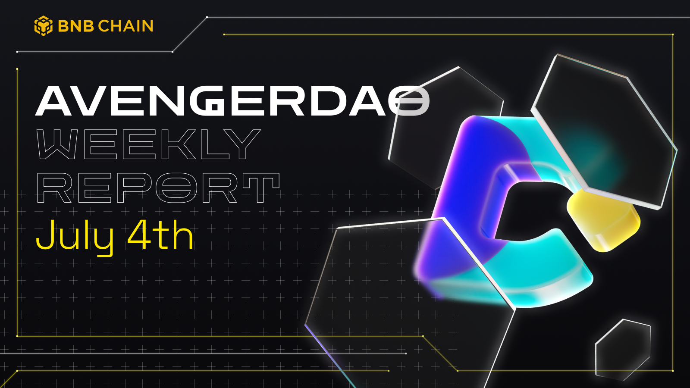

# AvengerDAO Weekly Report (June 27th - July 4th)

[AvengerDAO](https://www.bnbchain.org/en/blog/introducing-avengerdao-the-security-initiative-protecting-users-from-malicious-actors/?ref=binance.ghost.io) is a community driven initiative created to protect the users and projects on BNB Chain from malicious actors and activity.  [AvengerDAO](https://www.bnbchain.org/en/blog/introducing-avengerdao-the-security-initiative-protecting-users-from-malicious-actors/?ref=binance.ghost.io) publishes a list of risk projects and addresses on [DappBay Red Alarm](https://dappbay.bnbchain.org/red-alarm?ref=binance.ghost.io) every Friday. Any items that fall into one or more of the following categories are listed:

1. Ponzi Scam: Any item associated with a Ponzi scheme or fraudulent activity that deceives users.
2. Closed Source Ecosystem: Items that restrict transparency and hinder the ability to audit or verify the underlying processes.
3. Backdoor Functions Threatening User Funds: Items containing backdoor functions that pose a direct threat to user funds, compromising the security and control of their assets.
4. Severe Centralization Problem: Items displaying a significant level of centralization, which goes against the principles of decentralization and undermines the overall security and resilience of the system.

By actively identifying and flagging such items through DappBay’s Red Alarm, [AvengerDAO](https://www.bnbchain.org/en/blog/introducing-avengerdao-the-security-initiative-protecting-users-from-malicious-actors/?ref=binance.ghost.io) can help users identify high-risk BNB Chain dApps with the level of risk, the risk description, and other important risk details. Web3 users can safely navigate BNB Chain dApps while staying safe.

# High-Risk dApp Projects

| CATEGORY                               | DESCRIPTION                                                  | SPOTTED PROJECT THIS WEEK                                    |
| :------------------------------------- | :----------------------------------------------------------- | :----------------------------------------------------------- |
| Ponzi or potential Ponzi dApps         | Ponzi schemes lure investors with the false promise of extremely high returns. | [BNBMiner](https://dappbay.bnbchain.org/detail/bnbminer?ref=binance.ghost.io) |
| Phishing dApps                         | Phishing usually forges legitimate web pages to trick you into entering your private keys or authorizing transactions that you don't understand. | [Wall Street Memes](https://dappbay.bnbchain.org/detail/wall-street-memes?ref=binance.ghost.io) [Claim PEPE Gift](https://dappbay.bnbchain.org/detail/wall-street-memes?ref=binance.ghost.io) |
| Honeypot dApps                         | A honeypot is a way of trapping someone’s crypto. A scammer creates a new coin and through the code, enables the ability for only their wallet to withdraw funds. A user only realizes that it’s a honeypot when the user tries to withdraw their funds, and they can’t. | [Avarice](https://dappbay.bnbchain.org/detail/avarice?ref=binance.ghost.io) |
| Backdoor methods or potential backdoor | A backdoor in crypto is similar to a backdoor being a weak spot in a castle’s defenses. Backdoors are built purposefully into the smart contract with the intention of bypassing security. | [Czodiac](https://dappbay.bnbchain.org/detail/czodiac?ref=binance.ghost.io) |
| High fees                              | High token fees are fees incurred when buying, selling, staking, or withdrawing tokens from a dApp. High fees both ways mean users incur the cost of the transaction. | [Inuko Finance](https://dappbay.bnbchain.org/detail/inuko-finance?ref=binance.ghost.io) |
| Lack of documentation and whitepapers  | a lack of documentation and whitepapers can most likely indicate a risky dApp | [HyperFinance](https://dappbay.bnbchain.org/detail/hyper-finance?ref=binance.ghost.io) |
| Unverified contracts                   | Unverified contracts make it difficult for users to read the source code, analyze the logic or conduct due diligence. However, not all dApps with unverified contracts are causes for concern as dApps can work on verifying their smart contracts. | [KingFinance](https://dappbay.bnbchain.org/detail/king-finance?ref=binance.ghost.io) [JumpTask](https://dappbay.bnbchain.org/detail/jumptask?ref=binance.ghost.io) PolyNetwork |
| Websites do not work or work properly  | If websites, dApps, or platforms don’t work or work as intended, then there is a certain level of risk associated with using them. | [Clan Game](https://dappbay.bnbchain.org/detail/clan-game?ref=binance.ghost.io) [DeepLock](https://dappbay.bnbchain.org/detail/deeplock?ref=binance.ghost.io) [Nerve Finance](https://dappbay.bnbchain.org/detail/nerve?ref=binance.ghost.io) [Roao Game](https://dappbay.bnbchain.org/detail/roaogame?ref=binance.ghost.io) [Supre Futurism](https://dappbay.bnbchain.org/detail/suprefuturism?ref=binance.ghost.io) |
| Anonymous Teams                        | Anonymous teams and developers don’t always mean that a dApp is risky. Satoshi Nakamoto, the creator of Bitcoin, was an anonymous developer. However, several risky dApps share a common theme of anonymous teams or people. | [Depth](https://dappbay.bnbchain.org/detail/depthfi?ref=binance.ghost.io) [OrbitalSwap](https://dappbay.bnbchain.org/detail/orbital-swap?ref=binance.ghost.io) |
| Imposer dApps                          | A scammer creates a fake dApp with an identical name, logo, description, etc. However, the contracts of the fake dApp differ from the original. Unsuspecting users mistake the fake token for the original when interacting with it. | [Galaxy Vc](https://dappbay.bnbchain.org/detail/galxe-vc?ref=binance.ghost.io) |

## High-Risk Address

[AvengerDAO](https://www.bnbchain.org/en/blog/introducing-avengerdao-the-security-initiative-protecting-users-from-malicious-actors/?ref=binance.ghost.io) members offer APIs to check the security of a contract to be interacted with or get relevant information such as potential risks of a specific address to perform due diligence. [AvengerDAO](https://www.bnbchain.org/en/blog/introducing-avengerdao-the-security-initiative-protecting-users-from-malicious-actors/?ref=binance.ghost.io) API gives comprehensive evaluation of each address.

We advise you to regularly check with these APIs when receiving an airdrop for a certain token, or interacting with the contracts.

[https://dappbay.bnbchain.org/risk-scanner](https://dappbay.bnbchain.org/risk-scanner?ref=binance.ghost.io) is integrated with these APIs. Please give it a try!

**List of latest high risk addresses detected from Weekly Scan.**

| **No.** | **BSCScan Link**                                             |
| ------- | ------------------------------------------------------------ |
| 1       | [https://bscscan.com/address/0x685bfdd3c2937744c13d7de0821c83191e3027ff](https://bscscan.com/address/0x685bfdd3c2937744c13d7de0821c83191e3027ff?ref=binance.ghost.io) |
| 2       | [https://bscscan.com/address/0x4fe59adcf621489ced2d674978132a54d432653a](https://bscscan.com/address/0x4fe59adcf621489ced2d674978132a54d432653a?ref=binance.ghost.io) |
| 3       | [https://bscscan.com/address/0x2d1cfbb3468f78f916cca25f050d44b6115392e0](https://bscscan.com/address/0x2d1cfbb3468f78f916cca25f050d44b6115392e0?ref=binance.ghost.io) |
| 4       | [https://bscscan.com/address/0x625b02b687ec38f3085af5b108dda410775fa76a](https://bscscan.com/address/0x625b02b687ec38f3085af5b108dda410775fa76a?ref=binance.ghost.io) |
| 5       | [https://bscscan.com/address/0xc391a88165d9e23ebd28c2e220c5f9900d1d8f35](https://bscscan.com/address/0xc391a88165d9e23ebd28c2e220c5f9900d1d8f35?ref=binance.ghost.io) |
| 6       | [https://bscscan.com/address/0x224b239b8bb896f125bd77eb334e302a318d9e33](https://bscscan.com/address/0x224b239b8bb896f125bd77eb334e302a318d9e33?ref=binance.ghost.io) |
| 7       | [https://bscscan.com/address/0x2caa4694cb7daf7d49a198dc1103c06d4991ae52](https://bscscan.com/address/0x2caa4694cb7daf7d49a198dc1103c06d4991ae52?ref=binance.ghost.io) |
| 8       | [https://bscscan.com/address/0xb0fb5739da1198329b0241cb6721da22805cbecc](https://bscscan.com/address/0xb0fb5739da1198329b0241cb6721da22805cbecc?ref=binance.ghost.io) |
| 9       | [https://bscscan.com/address/0x65efb57c57c0b870f378ba08ee6ba305ca14491f](https://bscscan.com/address/0x65efb57c57c0b870f378ba08ee6ba305ca14491f?ref=binance.ghost.io) |

## Stay Safe

[AvengerDAO](https://www.bnbchain.org/en/blog/introducing-avengerdao-the-security-initiative-protecting-users-from-malicious-actors/?ref=binance.ghost.io) advise you to act with caution in general, but ask that you take particular care when dealing with the projects we highlight as risky on our weekly update. Continue enjoying BNBChain ecosystem and most importantly, stay SAFU!

## About AvengerDAO

[AvengerDAO](https://www.bnbchain.org/en/blog/introducing-avengerdao-the-security-initiative-protecting-users-from-malicious-actors/?ref=binance.ghost.io) is a community driven initiative that protects users from possible exploits, scams and malicious actors on BNB Chain. The founding members of AvengerDAO started this because BNB Chain is the largest public chain today, and the larger the community, the greater the responsibility. Our goal is to protect users from financial losses and malicious contracts. Deter malicious actors and notify BNB Chain’s users. We aim to enhance further adoption by setting an industry standard for safe practices and raise awareness on safety and security in the ecosystem.

**Reference:**

[https://www.bnbchain.org/en/blog/dappbay-red-alarm-dapp-risk-list-jan-20th-jan-27th-2/](https://www.bnbchain.org/en/blog/dappbay-red-alarm-dapp-risk-list-jan-20th-jan-27th-2/?ref=binance.ghost.io)

[https://www.certik.com/resources/blog/6VX76g4MisPev2Gz1GbdkY-march-2023-monthly-report](https://www.certik.com/resources/blog/6VX76g4MisPev2Gz1GbdkY-march-2023-monthly-report?ref=binance.ghost.io)

***Disclaimer: The information provided through the BNB Chain community does not constitute advice or recommendation for investment or trading. Projects are listed in no particular order below. BNB Chain does not take responsibility for any of your investment decisions. Please seek professional advice before taking financial risks.***

### Follow us to stay updated on everything BNB Chain!

[Website](https://www.bnbchain.org/en?ref=binance.ghost.io) |[ Twitter](https://twitter.com/BNBCHAIN?ref=binance.ghost.io) |[ Twitter (Devs)](https://twitter.com/BNBChainDevs?ref=binance.ghost.io) |[ Telegram](https://t.me/bnbchain?ref=binance.ghost.io) |[ dApp Store](https://dappbay.bnbchain.org/?ref=binance.ghost.io) |[ YouTube](https://www.youtube.com/@BNBChainOfficial?ref=binance.ghost.io) |[ Discord](https://discord.gg/bnbchain?ref=binance.ghost.io) | [LinkedIn](https://www.linkedin.com/company/bnbchaininnovation/?ref=binance.ghost.io) |[ Build N' Build Forum](https://www.buildnbuild.dev/?ref=binance.ghost.io) |[ Dev Community](https://bnbdev.community/?ref=binance.ghost.io)|
